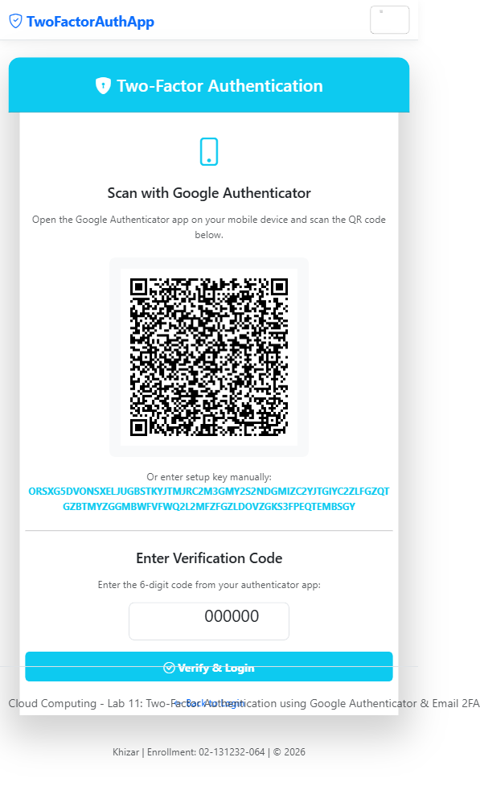
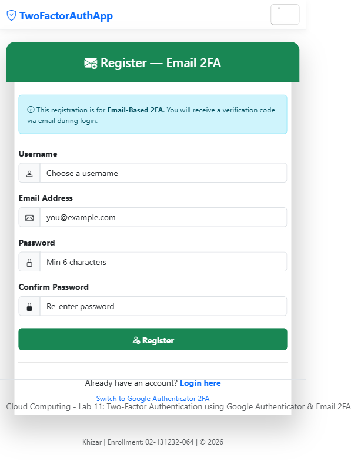
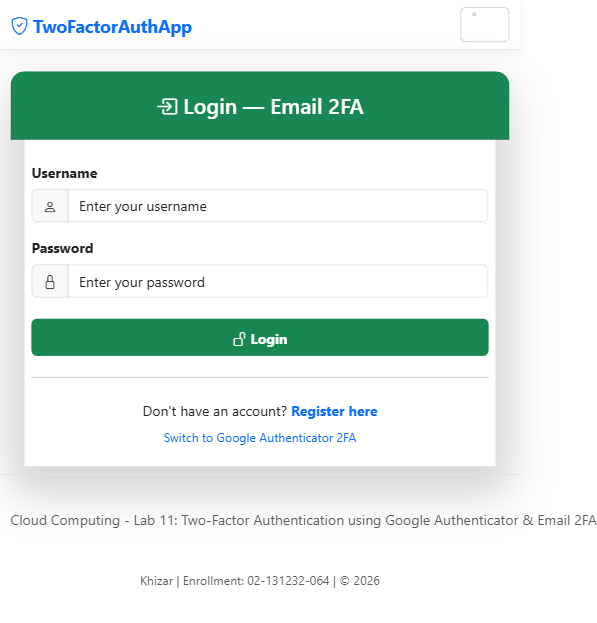
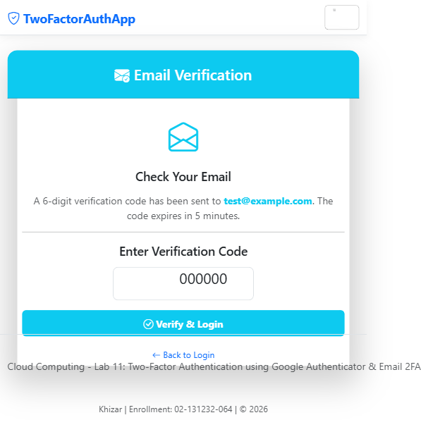

# Two-Factor Authentication App (ASP.NET Core MVC)

Two-Factor Authentication (2FA) demo app with **Google Authenticator (TOTP)** and **Email-Based** verification.

Built for **Cloud Computing Lab 11** — ASP.NET Core MVC with Entity Framework Core, SQL Server Express, and BCrypt password hashing.

---

## Features

### Task 1: Google Authenticator 2FA
- QR code generation via `GoogleAuthenticator` library
- TOTP (Time-based One-Time Password) verification
- BCrypt password hashing
- Account lockout after 3 failed attempts (5-minute lockout)
- Session-based authentication state

### Task 2: Email-Based 2FA
- User registration with email address
- Random 6-digit verification code with 5-minute expiry
- Real SMTP email delivery via **MailKit** (or mock mode for development)
- Separate controller and views (clear separation from Task 1)

---

## Tech Stack

| Technology | Purpose |
|------------|---------|
| ASP.NET Core MVC (.NET 9) | Web framework |
| Entity Framework Core + SQL Server Express | ORM & data persistence |
| GoogleAuthenticator (BrandonPotter) | TOTP generation & QR codes |
| MailKit + MimeKit | SMTP email delivery |
| BCrypt.Net-Next | Password hashing |
| Bootstrap 5 + Bootstrap Icons | UI framework |

---

## Getting Started

### Prerequisites
- [.NET 9.0 SDK](https://dotnet.microsoft.com/download/dotnet/9.0)
- SQL Server Express (local instance `.\SQLEXPRESS`)
- Visual Studio 2022 (recommended) or any editor

### Setup

```bash
# Clone the repo
git clone https://github.com/Khizar525/TwoFactorAuthApp.git
cd TwoFactorAuthApp

# Restore packages
dotnet restore

# Update database
dotnet ef database update

# Run the app
dotnet run --urls "http://localhost:5000"
```

### Configure Email (Optional)

Edit `appsettings.json`:

```json
"EmailSettings": {
  "UseRealEmailService": true,
  "Smtp": {
    "Host": "smtp.gmail.com",
    "Port": 587,
    "Username": "your-email@gmail.com",
    "Password": "your-app-password",
    "FromEmail": "your-email@gmail.com"
  }
}
```

When `UseRealEmailService` is **false**, codes are logged to the console (mock mode).

---

## Routes

### Task 1: Google Authenticator 2FA

| Page | URL |
|------|-----|
| Register | `/Home/Register` |
| Login | `/Home/Login` |
| 2FA Verify | `/Home/TwoFactorAuthenticate` |

### Task 2: Email-Based 2FA

| Page | URL |
|------|-----|
| Register | `/Account/Register` |
| Login | `/Account/Login` |
| Verify Code | `/Account/VerifyTwoFactor` |

---

## Project Structure

```
TwoFactorAuthApp/
├── Controllers/
│   ├── HomeController.cs          # Google Auth 2FA
│   └── AccountController.cs       # Email 2FA
├── Models/
│   ├── UserModel.cs
│   ├── LoginModel.cs
│   ├── RegisterModel.cs
│   ├── TwoFactorModel.cs
│   ├── Email2FAModel.cs
│   └── AuthDbContext.cs
├── Services/
│   ├── IEmailService.cs           # Email service interface
│   ├── SmtpEmailService.cs        # Real SMTP via MailKit
│   └── MockEmailService.cs        # Console logger (dev mode)
├── Views/
│   ├── Home/                      # Task 1 views
│   │   ├── Register.cshtml
│   │   ├── Login.cshtml
│   │   ├── TwoFactorAuthenticate.cshtml
│   │   └── Index.cshtml
│   └── Account/                   # Task 2 views
│       ├── Register.cshtml
│       ├── Login.cshtml
│       ├── VerifyTwoFactor.cshtml
│       └── Index.cshtml
├── Program.cs                     # App entry point & DI
└── appsettings.json               # Configuration
```

---

## Screenshots

### Task 1: Google Authenticator 2FA

| Register Page | Login Page |
|:---:|:---:|
|  |  |

| QR Code & TOTP Verification |
|:---:|
|  |

### Task 2: Email-Based 2FA

| Register Page | Login Page |
|:---:|:---:|
|  |  |

| Email Code Verification |
|:---:|
|  |

> **Note:** Dashboard and error-state screenshots are not available because Google Authenticator TOTP codes and real SMTP email delivery require a physical device / real credentials to complete the 2FA flow. Console mock-mode output was also not captured during this session.

---

## License

This project is for educational purposes — Cloud Computing Lab 11.
